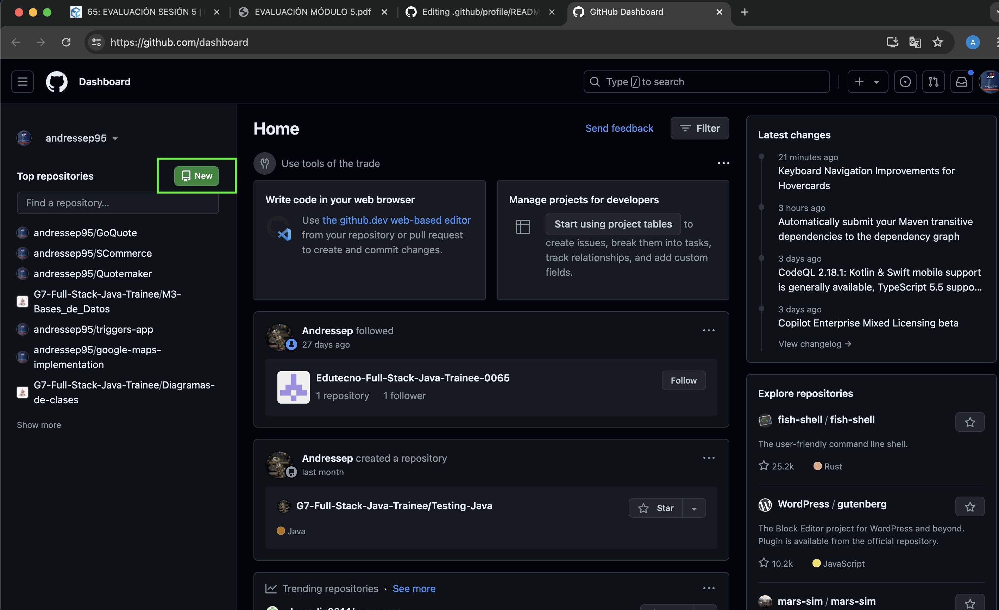
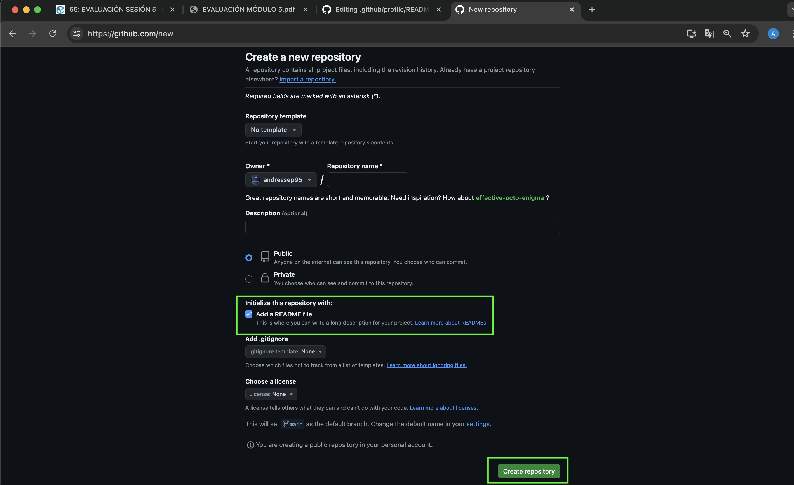
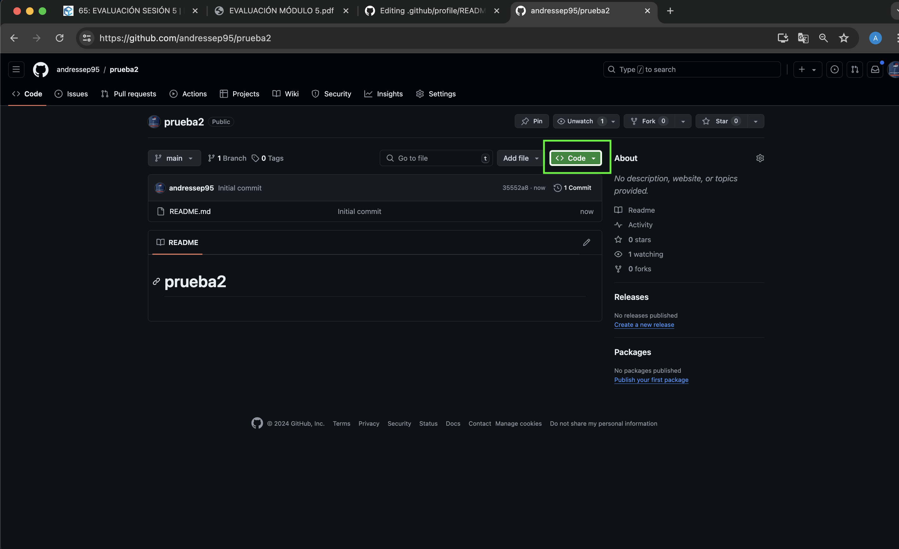
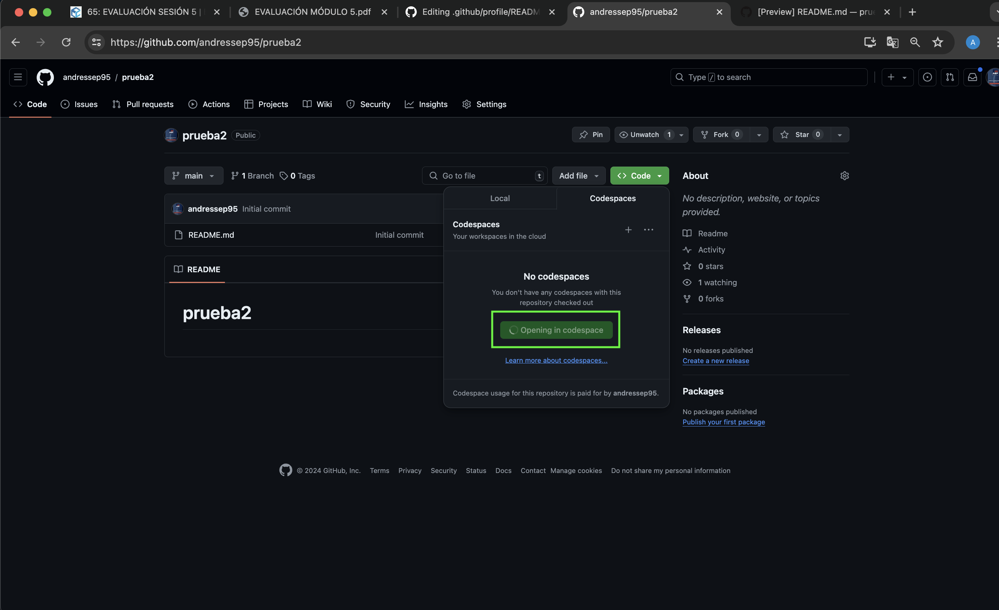

# Fljo de trabajo para Codespaces
En este documento se detalla el paso a paso para realizar contribuciones a traves Github Codespaces en nuestros proyectos.

## 1. Entrar a su 'Home' en Github o pagina principal
Para empezar, debe de situarse en la pagina inicial de 'su perfil de github', estando alli debe de dar 'Click' en la opcion 'New' para iniciar un repositorio nuevo, esto en caso de que este generando un proyecto por primera vez (si va a interactuar con un proyecto ya existente ignore este paso).

- Navega a [Home](https://github.com/dashboard) en Github.
- Ingrese a la opcion **New** la cual se ubica a la izquierda en color verde.
- 

## 2. Ingresar los datos necesarios para la creacion del proyecto
En caso de estar creando un proyecto nuevo debe de ingresar la informacion inicial de dicho proyecto.

- Marque los campos que considere necesarios, es conveniente generar el archivo README.md para usarlo como notas o como informacion importante del proyecto.
- Al terminar de llenar los campos seleccione **Create Repository**
- 

## 3. Iniciar Codespaces
Una vez creado el repositorio se debe de iniciar el **Codespaces**

- Seleccione la opcion marcada como **Code** -> **Create Codespaces On Main**
- Esto deberia abrir una pestaña adicional con el **Codespaces** abierto listo para comenzar a hacer codigo.
- 
- 

## 4. Instale sus extensiones y comience a escribir codigo.
Configure su **Codespace* y comience a escribir codigo como hace habitualmente
